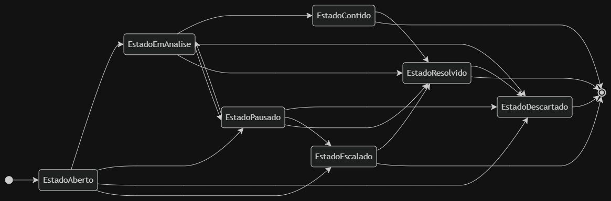
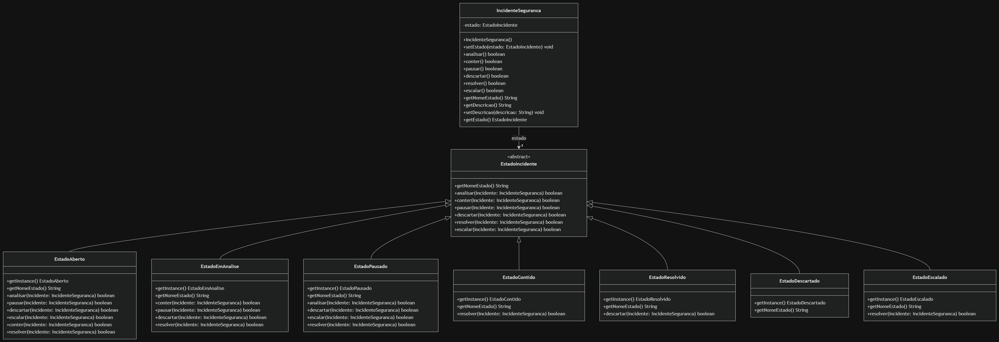

# Padrão State - Ciclo de Vida de Incidentes de Segurança

Implementação do padrão de projeto **State** (Comportamental) em Java, aplicado a um sistema de resposta a incidentes de segurança (SOC).

---
## Sobre o Projeto

O padrão State é um padrão comportamental que permite a um objeto alterar seu comportamento quando seu estado interno muda, fazendo com que pareça ter mudado de classe. 

### Problema de Negócio
Em um SOC, um incidente de segurança passa por diferentes fases (Aberto, Em Análise, Contido, Resolvido, etc.). Cada fase permite apenas determinadas ações:
- Não se pode **conter** um incidente já **resolvido**
- Não se pode **escalar** um incidente **descartado**
- Um incidente **pausado** precisa ser **reanalisado** antes de ser contido

Sem o padrão State, isso resultaria em dezenas de `if/else` ou `switch` aninhados, violando o **Princípio Aberto/Fechado** e tornando o código difícil de manter.

### Solução Implementada
Cada estado é uma classe separada que encapsula seu próprio comportamento. A classe `IncidenteSeguranca` delega todas as ações para o estado atual, permitindo transições limpas e testáveis.

---

## ️ Arquitetura do Sistema

### Diagrama de Máquina de Estados



**Legenda:**
-  **Círculo Preto**: Estado inicial do sistema
-  **Retângulos Arredondados**: Estados concretos do sistema
- ️ **Setas**: Transições válidas entre estados
-  **Círculo com Alvo**: Estados finais (fim do ciclo de vida)

**Fluxo Principal:**
1. **EstadoAberto** → Estado inicial quando o incidente é reportado
2. **EstadoEmAnalise** → Analista investiga o incidente
3. **EstadoContido** → Ameaça foi isolada
4. **EstadoResolvido** → Incidente finalizado com sucesso

**Fluxos Alternativos:**
- **EstadoPausado** → Investigação temporariamente suspensa
- **EstadoEscalado** → Incidente crítico enviado para equipe sênior
- **EstadoDescartado** → Falso positivo ou irrelevante

### Diagrama de Classes



**Componentes:**

| Classe | Responsabilidade | Padrão |
|--------|-----------------|--------|
| `IncidenteSeguranca` | Contexto principal que mantém o estado atual e delega ações | Context |
| `EstadoIncidente` | Classe abstrata que define o contrato de todos os estados | State |
| `EstadoAberto`, `EstadoEmAnalise`, etc. | Implementações concretas de cada estado | ConcreteState |

**Características Técnicas:**
- **Singleton em todos os estados**: Cada estado possui `getInstance()`, garantindo apenas uma instância em memória (economia de recursos)
- **Delegação total**: `IncidenteSeguranca` não possui lógica de negócio, apenas delega para o estado atual
- **Transições explícitas**: Cada estado define para qual próximo estado ele pode transicionar

---

## Estrutura do Projeto
```bash
PadraoState/
├── src/
│ ├── main/java/padroescomportamentais/state/
│ │ ├── IncidenteSeguranca.java # Contexto (1 classe)
│ │ ├── EstadoIncidente.java # State Abstrata (1 classe)
│ │ ├── EstadoAberto.java # ConcreteState (7 classes)
│ │ ├── EstadoEmAnalise.java
│ │ ├── EstadoPausado.java
│ │ ├── EstadoContido.java
│ │ ├── EstadoResolvido.java
│ │ ├── EstadoDescartado.java
│ │ └── EstadoEscalado.java
│ │
│ └── test/java/padroescomportamentais/state/
│ └── IncidenteSegurancaTest.java # 42 testes unitários
│
└── pom.xml # Maven + JUnit 5
```

**Total: 9 classes + 42 casos de teste**

---

## Como Executar os Testes

### Pré-requisitos
- Java 21 ou superior
- Maven 3.6+

### Comandos

```bash
# Navegue até a pasta do projeto
cd PadraoState

# Execute todos os testes
mvn test

# Ou execute via IntelliJ IDEA
# Clique direito em IncidenteSegurancaTest.java → Run 'IncidenteSegurancaTest'
```

## Cobertura de Testes
- 42 testes cobrindo todas as transições possíveis
- Validação de ações válidas (retornam true e mudam estado)
- Validação de ações inválidas (retornam false e mantêm estado)
- Validação do Singleton (mesma instância para cada estado)
  
## Diferenciais de Implementação

### Por que 9 classes em vez de 8?
A maioria dos exemplos acadêmicos do padrão State utiliza 6 estados concretos. Este projeto implementa 7 estados, adicionando o EstadoEmAnalise como um estado intermediário crítico.

#### Justificativa Técnica:
**No fluxo real de um SOC, existe uma diferença clara entre**:
- **Aberto**: Incidente reportado, aguardando triagem
- **Em Análise**: Analista ativamente investigando, coletando evidências
    
**Essa separação permite**:
- **Métricas mais precisas**: Tempo em triagem vs. tempo em análise
- **SLA diferenciado**: Prazos diferentes para cada fase
- **Auditoria**: Rastreabilidade completa do ciclo de vida

## Comparação com Outros Padrões

| Padrão | Categoria | Quando Usar | Exemplo no Projeto |
| :--- | :--- | :--- | :--- |
| **State** | Comportamental | Quando um objeto precisa mudar seu comportamento baseado no seu estado interno | Ciclo de vida de incidentes de segurança (Aberto, Em Análise, Contido) |
| **Strategy** | Comportamental | Quando é necessário trocar algoritmos ou comportamentos em tempo de execução | Seleção de algoritmos de criptografia (AES, RSA, SHA256) |
| **Observer** | Comportamental | Quando múltiplos objetos precisam ser notificados automaticamente sobre mudanças de estado | Central de ameaças notificando analistas de segurança inscritos |

## Conceitos Aplicados

### Princípios SOLID
- SRP (Single Responsibility): Cada classe de estado tem uma única responsabilidade
- OCP (Open/Closed): Novo estado pode ser adicionado sem modificar código existente
- LSP (Liskov Substitution): Qualquer estado pode substituir outro sem quebrar o sistema
- DIP (Dependency Inversion): Contexto depende da abstração EstadoIncidente
  
### Padrões de Projeto
- State (GoF): Padrão principal implementado
- Singleton: Otimização de memória nos estados concretos

### Boas Práticas
- Programação orientada a interfaces
- Baixo acoplamento entre classes
- Alta coesão dentro de cada estado
- Testes unitários com cobertura completa

## Tecnologias Utilizadas

| Tecnologia | Versão | Finalidade no Projeto |
| :--- | :--- | :--- |
| **Java** | 21 | Linguagem de programação principal |
| **Maven** | 3.9+ | Gerenciamento de dependências e automação de build |
| **JUnit 5** | 5.9.x | Framework para execução dos 42 testes unitários |
| **Draw.io** | Web | Criação e exportação dos diagramas UML (PNG e Mermaid) |
